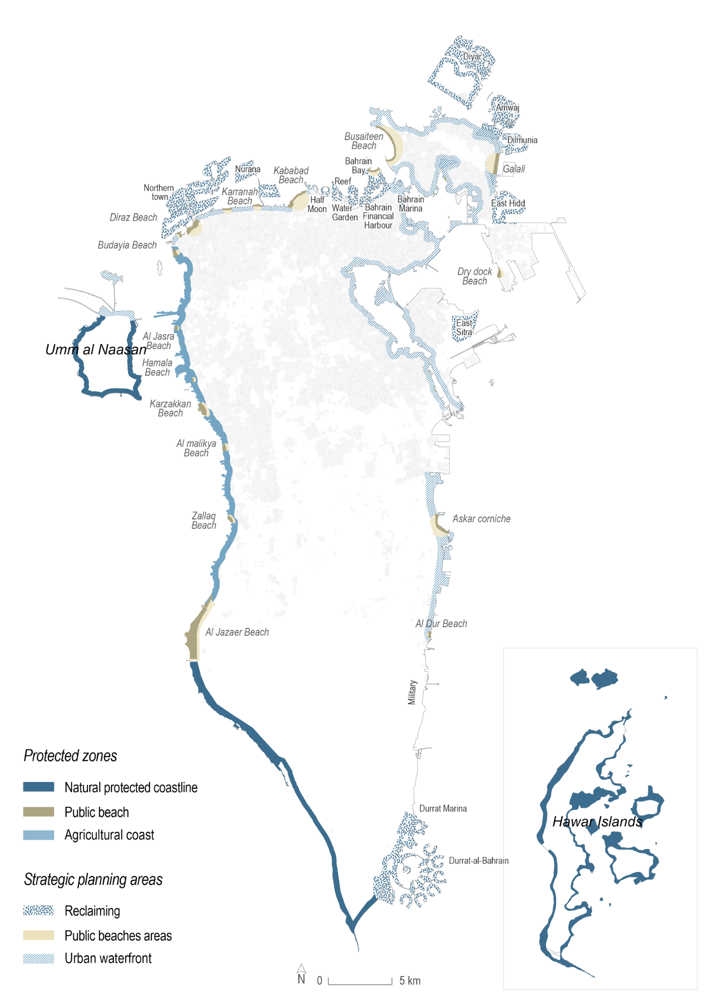

# Waterfront Guidelines

## Introduction
### Why asset guidelines?
The island country of Bahrain has a wealth of cultural, historical, landscape and ecological assets that distinguish it from other countries in the Middle East tourist value.
A landscape policy must be drafted. To do so requires approach rooted in Bahrain’s national identity and developing a shared vision of the country’s landscape. This approach, targeting generally recognized assets, pursues three key successive courses of action:
Identify and protect most sensitive sites;
Promote sites of interest;
Expand by creating links between protected and promoted sites.
These courses of action will be launched from protected areas around which Special Planning Areas (SPA’s) will be defined in the immediate or more distant vicinity. For each of these SPA s, dedicated guidelines will have to be respected. (Strategic Plan)
The asset guidelines comprise three sets of recommendations and best practices to be implemented close to protected areas, namely: Heritage Asset Guidelines, Waterfront Asset Guidelines and Green Asset Guidelines. These recommendations specific to each typology of assets complement the recommendations of the Project Guidelines, which apply to all major development projects, and the Public Waterfront guidelines, which apply to the public Waterfront.

## Why Guidelines for the Waterfront?
The Waterfront is a major asset for Bahrain.
The Kingdom of Bahrain is an island whose relationship with the sea is of fundamental importance.
Shipbuilding, maritime trade and fishing have been the island’s major historic lines of business. More recently, the EDB has identified tourism and leisure as being among the island’s four key investment sectors. In terms of conservation and development, turning the Waterfront into a major Bahraini tourist attraction has become a priority.
The waterfront is a central area for the wellbeing of Bahrainis, GCC visitors and international tourists. It is an environment with:
marine valuable resources
a high urbanization and a concentration of major mobilities;
many Mega projects developed, underway or planned;
a wealth of cultural and heritage assets;
a diversity of landscapes.
the overarching goal of these guidelines is to make the Waterfront more resilient and reach sustainable development goals:
Secure space for public use on Waterfront
Restoring continuity and guarantee a public access to the coastline;
Facilitate the access to the coastline : pedestrian, public transport, non-motorized modes;
Ensure physical and visual connection to the waterfront through a specific landscape.
For the long-term enhancement of the coastline, it is necessary to protect its most fragile stretches. The following protected spaces must not be developed at all.
public beaches
wild stretches of coastline
marine resources
In the following most valuable places, i.e. the Special Planning Areas (SPAs), development must be kept under control:
built-up areas
beach areas
land reclamations.
The Waterfront Guidelines make a series of recommendations to developers and instructors involved in residential or mixed-use projects on how to preserve, enhance and develop the Bahraini coastline.
These recommendations do not apply to developers of strictly industrial or business projects.

### Les Special Planning Areas

3 types de SPECIAL PLANNING AREAS waterfront sont à développer au regard de specific recommendations:
in developed areas, the NLP designates a 300 meter wide strip where specific recommendations apply, il s’agit des SPECIAL PLANNING AREAS (SPAs). On distingue 3 SPAs différentes en fonction de leur localisation sur la côte et leur destination.

!!! note "Built up Waterfront"   
    Dans les areas urbanisées, la National Land Policy identifie une bande de 300 m d’épaisseur en partant du trait de côte, dans laquelle un soin particulier sera apporté aux développements pour en faire des espaces de vie, animés de jour comme de nuit toute l’année. L’identité de chacune des séquences du littoral urbain devra être mise en valeur.

!!! tip "Beaches Area"
    The development of spaces close to public beaches must highlight proximity to the sea and direct access to the water. Areas close to the beaches will be dedicated to leisure activities accessible to the general public.

!!! danger "Reclamations"
    In areas where developments in the sea are authorised by the Strategic Plan, they must pay particular attention to defining new identities, while limiting any impacts on the marine environment.

### Planning principles
#### General principles
Endowed with unique natural features (waterfront, palm groves) and a rich heritage, Bahrain is a uniquely pleasant place to live in and visit. Beyond their immediate objectives of helping to improve urban development, the Guidelines are inspired by the intent to emulate, enhance and adapt to modern days the practices that shaped successful human settlements by the inhabitants and visitors and to ensure sustainability over time. This aim concerns all the inhabitants’ living spaces: i.e. the spaces they use to travel, to conduct their everyday professional activities, to share moments with their families every weekend, to locate their homes and design their layout, etc. To ensure the well-being of the inhabitants and visitors, the spaces they occupy and cross must meet three conditions. They must have:

**★ A unique identity:**
Bahrain features places on a human scale, well adapted to the local climate and uses, in a varied landscape in which it is easy to find your bearings. Bahrain’s urban tradition, on which its uniqueness in the regional context is based, is the driver of its attractiveness, which needs to be sustained.

**★ A healthy environment:**
Preserving the environment ensures the psychological well-being and physical good health of the inhabitants. To maintain the attractiveness of the Kingdom, it is necessary to limit the impact of human activities on the quality and temperature of the air, the quality of the ground and of the natural spaces, and to keep pollution levels low.

**★ Sober developments:**
Energy-efficient and sustainable developments will make the cost of living borne by the final users affordable and durable as soon as they invest. This comprehensive
vision of a project’s cost ensures that it gains in value: in fact, its attractiveness will be driven by good maintenance of spaces, buildings and infrastructures. These principles underpin the «place-making» method the Guidelines describe. They are applicable to all scales of project, from the largest involving entire parts of a town or city to the design and development of the smallest living spaces. From these basic values ensue the urban development principles and tools that make it possible to build communities that have the «ingredients of urbanity», making cities successful and attractive.

##### Accessibility
In order to produce the expected results in terms of economic and social benefits, the transformation of the Waterfront must be supported by a massive effort to enable as many people as possible to have access to it, enjoy it and benefit from the services provided.

**A coastline open to the public:** the large-scale privatisation of the coastline in Bahrain has its limitations in terms of capitalising on its economic potential. Opening up the coastline to the public and deploying dense, mixed-use and attractive construction programmes hold out the prospect of much higher land rents and permanent sources of income (multiplication of property charges, revenue from commercial leases, revenue from temporary uses and public land concessions, etc.). Welcoming all kinds of visitors (national, from GCC countries, international) will increase the well-being of a much larger proportion of the population (see #sober developments).

**A developed coastline:** the coastline accessible to the public should be developed in line with current and future uses. It should provide safe continuous space along the seafront for walking and other leisure activities in conditions sufficiently comfortable for a range of pedestrians, joggers, cyclists, etc. The construction programmes developed near the Waterfront will finance these developments (see #a unique identity).
**Value enhancement supported by the national mobility plan:** the attractiveness of the seafront is to be supported by the national transport network. The intent is to make it easier for people to use means of transport other than cars such as: paths/links for non-motorised means of transport and public transport stops located close to the seafront, which provide easy access to leisure facilities and Waterfront construction programmes (see #a healthy environment).

??? note "Keywords"
    * **Coastline:** the coastline is where the sea and the emerged land meet. This coastline moves according to the natural movements of the sand and the tides, especially in areas not artificially occupied.
    * **Exclusion strip:** this is a strip of land whose width varies from one * place to another. No construction work is allowed in this strip in order to maintain free access along the whole length of the coast. In places where the coastline moves, this exclusion strip protects its natural movements.
    * **Pedestrian longitudinal easement:** all new developments must allow pedestrians to enjoy a minimum amount of freedom of movement in the exclusion strip, so a footpath is included. It is in the form of a strip of land with a variable width, which is left construction-free and fence-free.
    * **Pedestrian transversal easement:** accessibility to the seafront from the hinterland is ensured by at least several low-impact links. Being perpendicular to the coastline, they provide regular access to the sea. They may consist of public paths or private paths open to the public.

##### Diversity (mixed use)
The Guidelines advocate an increase in the diversity of functions, uses and building forms especially on the waterfront. This diversity, which is already part of Bahrain’s urban waterfront tradition, has numerous benefits in terms of delivering needs-based, economically viable developments.

**Economic equilibrium:** the Guidelines propose to capitalise on the great financial dynamics of urban development on the waterfront, notably the dynamics generated by large-scale projects,. The variety of land uses, built environments and target customers and users makes it possible to develop a balanced portfolio of real estate products which commercialisation is less risky for developers. Such variety ensures proper end-to-end project development, qui participent à l’image du pays et à son attractivité. (#Sober developments)

**Multiple uses of public spaces:** mixed uses made for lively public spaces both by day and by night, during working hours and weekends. This combination of timescales helps to save space and to identify lively and attractive places for residents and tourists alike. Sur le waterfront, ils constituent la vitrine de Bahreïn dans le monde. (#A unique identity)
Reduced travel time: mixed uses and activities make it possible to concentrate several key functions in a single place, such as a restaurant close to a leisure area and to public transportation center. This enables the inhabitants to save time, energy and money by avoiding certain trips. It also reduces travel-related pollution. (#A healthy environment)

???+ note "Related Keyword Definitions"
    * Urban programming: the identification, quantification and definition of the functions of a space in line with its ambition, identified needs, market conditions, and the project’s economic feasibility as well as the spatial distribution of all these features.
    * Consistency: the overall harmony and complementarity obtained by assembling together different entities (buildings, open space, public realm) in compliance with specific rules governing forms, volumes, materials, etc.
    * Mixed use: diversity of functions in a neighbourhood (e.g. integration of an urban centre featuring convenience stores and small restaurants) or in a building (e.g. integration of a shop on the ground floor of a small housing block).

##### Safety and comfort:
To be attractive and lively, most coastal spaces are dedicated to non-motorised modes of mobility, particularly on foot. The public spaces allow the development of multiple uses: walking, picnicking, swimming, sports, etc. They provide opportunities for relaxing alone or in a group and for leisure activities and shopping. They are developed to ensure the comfort and safety of users throughout the day and the year.

**Simple and safe street and road crossings:** the crossing of streets and roads by pedestrians is made easier. This makes it possible to enhance the modal share of non-motorised means of transport compared with the motor car, notably regarding daily journeys or leisure trips.

**Developments are focused on user needs:** they take into account users’ needs for shade, lighting, drinking water, urban furniture, etc. This makes public spaces attractive to a large section of the population. Trade and shopping flows also benefit from this.

**Pleasant and protected walkways:** simplifying and shortening pedestrian walkways and providing shaded footpaths help to develop low-impact modes of mobility. The Waterfront becomes the best place to transform the mobility strategy and become a showcase for low-impact, non-motorised modes of mobility.

##### Sense of place
Bahrain's urban and trading tradition started on the waterfront: its unique identity is still  visible in all its historic urban centres. This environment comprises specific urban and architectural forms structured around lively public spaces that allow many different activities to co-exist. Bahrain's originality must be sustained and reinvented to adapt to new users and the new aspirations of its inhabitants.

Creating unique spaces: in order to avoid developments that are the same as all the others, the key policy is to bring out Bahraini waterfront specificities as much as possible by strengthening the ingredients of urbanity: diversity of function; high-quality public spaces; sufficient and well-distributed amenities and services; the promotion of internal mobility in conjunction with the existing urban areas. All these conditions make it possible to enhance the value, effectiveness and competitiveness of unique places for the benefit of local residents and visitors alike. (#a unique identity)
???+ note "Related Keyword Definitions"
    * **Public realm:** public space made up of roads and streets, but also open spaces, parks and gardens accessible to the public and which account for a large portion of unbuilt urban spaces. These interstitial spaces are used for travelling, leisure activities, exchanges, trade, etc. Their structure and design are adapted to local climate conditions and uses, enhance the inhabitants' quality of life and reinforce the identity of the places (sense of place).
    * **Landscape:** it comprises the visual urban environment in all its forms - built up areas, unbuilt areas, planted spaces, topography, etc. These components contribute to our perception of a place, its beauty and its originality.

#### Planning intents
Protect and preserve the waterfront:
Stabilize the coastline by allowing a variety of uses;
Prevent environmental hazards (floods, landslide, etc.);
Preserve natural and vulnerable areas from polluting human activities (cars, polluting industries, etc.).
Invent a Waterfront sense of place:
Enhance the waterfront landscape diversity;
Create an attractive public space adapted to the uses;
Enhance transition spaces quality.
Reconnection and accessibility:
Ensure an access to the sea for all;
Reconnect the waterfront and the city;
Facilitate mobilities along the waterfront.


### Favour mixed-use development  
On the whole, the coastal spaces are attractive in terms of the diversity of programmes and users, encompassing informal and economic uses (fishing, horse-riding, housing, hospitality, service sector activities, etc.). This ensures the vitality of the Waterfront all year round, by day and by night.
The principles laid down in this chapter are based on those laid down in the Project Guidelines.  

### General Programming Principles
A diversity of urban functions and construction programmes is planned along the coastline: their strategic importance is due to their being located on the coastline rather than in other parts of Bahrain.
Programming will alternate quiet coastline segments with livelier ones;
Respect linear continuity featuring complementary centres of varying intensity.

Programming will endeavour to maintain existing activities, income generating or leisure, and ensure new development improves conditions and operations. To that purpose, consultation with existing users should be undertaken at the programming stage.

### Specific Requirements for each perimetre

#### Exclusion strip
An unbuilt area made up of open spaces and light structures.
No building will be permitted, except for light, temporary structures.
The non-constructible area will be mainly dedicated to non-motorised low-impact modes of mobility and to open spaces.
The programme will include visitor information facilities.

#### Seafront
This area corresponds to the first built frontage and to the exits of the perpendicular access ways to the sea.
The programme will sustain or enhance pre-existing uses, be they leisure (swimming, horse-riding) or economic (fishing, arts and crafts).
Land uses that impose restrictions on access will be prohibited in order to ensure public access to the beach and easements for pedestrian access (resorts, compounds, etc.).
The programming of activities relating directly to the Waterfront will evolve over time (temporary use/occupation of vacant lots, etc.).
Residential land uses will be balanced between locals, expats and tourists.
The hotel construction programmes will favour structures that respect the natural environment and landscape, and which complement the existing hotel offering.
Parking lots will not be visible on the seafront. Their preferred location will be landside.
Seafront facilities that meet the needs of local residents shall be accessible for both residents and visitors. It will be given the possibility of derogating from the maximum authorised distances between them;

#### Landside  
favour services and facilities that meet the needs of residents, economically active people and visitors to foster a diversity of users.
Projects that do not feature continuity with an existing urban fabric will have to be particularly autonomous from an employment point of view (with an Employment Concentration Indicator of between 0.6 and 1);
dynamic hubs will be located at the interface between tourist areas and neighbouring living quarters. They will be easily accessible from the seafront;
Developments located near the Waterfront will have to set their supply of parking spaces back from the seafront

### Specific Requirements per SPA

...

### Programmes recommended and to be avoided:

...

### Assessment tools

| **Document required** | **Content** | **Why is it required?** | **What is to be assessed?** | **Assessment criteria** | **Advice** |
| ----------------------| ----------- | ----------------------- | --------------------------- | ----------------------- | ---------- |
| Project outline | Development presentation, objectives and targeted population | In order to benefit the neighbourhood and the city as a whole, the project&#39;s aims must be aligned with the national, environmental, cultural and tourist strategy for the sector in which it is located. | -the project&#39;s image and identity must match-it must be adequately ambitious-The anticipated number of users (tourists and inhabitants) must take into account the fragility of the site.   | -The proposed programmes should enhance the site-The proposed programmes must be opened to the public-The proposed programmes must include existing usages-Asset classes on offer should be diversified and adapted to targeted market segments-The proposed density should be in line with the strategy. | A meeting should be held with the authorities concerned prior to the implementation of the project. |
| Market study | See [Mega project](../projects/mega.md) and [Major Subdivision](../projects/) Manuals  |
| Land use schedule (comprehensive and detailed for each land use) | Content of the project and detailed content of each program: -Land area-Built-up area-FAR and density | The project&#39;s impact on its environment must be assessed; its benefits must be real (functional mixed use, density, etc.); and its possible negative impact must be mitigated. (programme imbalances, excessive density or too low density, etc.) | -Land area-Built-up area-FAR and densityA balance must be struck between programmes dedicated to economic activities, tourism and the residential sector.   | The proposed programmes must meet the requirements set out in the chapter on the land use mix;The balance of the programme mix should be in line with the national strategy/ the sector&#39;s development strategy |   |
| | Number of expected users per category (residents / workers/visitors) | To ensure the harmonious development of the neighbourhood throughout the year, a balance must be struck between the working population, the residents and the tourists. The right density of development of the site must be found to enhance it and limit the consumption of land without threatening the site&#39;s environmental balance. | Ratio of tourists to habitantsDensity | The balance must not exceed one tourist for 0.3 inhabitants at the most.&gt; 100 inhab. /ha → High value appreciation / Strong environmental pressure50 - 100 inhab. /ha → Average value appreciation / average environmental pressure&lt; 50 inhab/ha → low value appreciation / low environmental pressure |   | | Services, amenities, open spaces, parking lots, utilities requirement/level of service | The supply of services and infrastructures must meet the needs of:-tourists-inhabitants-workersOver-supply would reduce economic profitability / under-supply would be detrimental to the neighbourhood&#39;s attractiveness | Meeting the specific requirements of tourists.Meeting the specific requirements of residents. | -Parking requirements:  study of traffic flows  -Services 4-8%-Community amenities and retail outlets: 1-4%-Open space requirements: 10% _See Mega project and Major sub-division Manuals_ |   |
| Land use plan | Spatialisation plan for the various programmes. | The programmes enhance the value of the Waterfront and do not harm its image.  The dynamic centres help to identify the project on a national scale. | Matching the recommendations made in the chapter on Land use distribution. The locations of the programmes enhance the Waterfront.
The location of the services, shops and amenities helps to create centres that are accessible to visitors and residents. | The land use Plan complies with the schedule of approved and disapproved programmes as indicated in the chapter on Land use distribution_Assessment of concentration of services 10 min &gt; Low accessibility5-10 min: adapted accessibility5 min &lt; High accessibilityThe distance to amenities does not exceed the distance recommended in the Project Guidelines by more than 30%. | The use of isochrones (10 minutes on foot from a centre) makes it possible to highlight the accessibility of the programmes. |
| Phasing | See Mega project and Major sub-division Manuals |
| Financial assessment | See [Mega project](../projects/mega.md) and [Major Subdivision](../projects/) Manuals |


## Ensure public access to the waterfront
Access to the waterfront is key to enhancing this asset. Continuity along it and connection between it and areas to its back are to be provided to ensure use and enjoyment by the public and reestablishing a strong relationship with the sea.
This part provides planning and design guidance for those linkages including for specific requirements for roads in the Waterfront area.

### Create linear continuities
#### Create promenades along large segments of the waterfront

#### Vary the relationships with the sea by developing the shores

### Facilitate access to the coastline from adjacent neighbourhoods
#### Create transversal access

### Turning the Waterfront into a showcase for virtuous modes of mobility
#### Foster the integration of public transport and road sharing
#### Improve connectivity between shore and islands
Pedestrian crossings and maritime transport links (taxi boats, etc.) may connect shores;
Foster public transport via waterways connecting different areas;
Pedestrian access to private islands, their roads and shorelines will be authorised.
Treatment of the coastline will favour the mooring of boats. Landing stages for boat shuttles (water taxis) will be available every 500m in dense urban areas.

#### Effective integration of heavy infrastructures
Seaside roads with heavy traffic (Distributor roads and above) will be turned into peaceful urban boulevards thanks to speed limits, traffic lights, suitably dimensioned roads, public transport lanes, wide sidewalks and street-level (ground floor) retail outlets, etc.
Local roads will optimize the functioning of services related to tourism and ports. Their integration into the immediate environment will be studied to avoid visual and physical barriers;
The presence of heavy infrastructures (highways, utility corridors, elevated transport lines, etc) along the coast will be avoided as much as possible on the water's edge. Otherwise, the following principles will apply:
They will be well-integrated into their environment to avoid visual and physical barriers.
Their impact will be limited thanks to devices such as plantations and the permeability and porosity characteristics of materials for ground cover.
Their presence will be offset by the development of:
Adjacent protected walkways for non-motorised mobility
Open and/or natural spaces developed onsite or elsewhere
The positioning of regular crossings (see 3.2)

## Stage the waterfront
### Reveal the coastal and seaboard landscape
The various schemes proposed here enable people to feel the presence of the seafront on different scales, reminding them of the insular nature of the Kingdom's identity.
#### Improve the perception of the sea from the coast and the adjacent neighbourhoods
Depending on each site's geographical context (heights, contours, etc.) it is necessary to preserve the existing views of the sea and to plan extra vistas;
Points of interest will be highlighted by developing vantage points (belvederes, etc.):
wherever the shape of the coast is suitable (capes, etc.);
wherever facing remarkable coastal landscape (islands, urban or port skylines, etc.);
Set the hierarchy of views in accordance with the requirements of the developments.
##### Create a remarkable "coastal landscape"
The planning of seafront built and non-built forms helps to create a coastal landscape visible from the sea and the coastline facing each other;
The diversity of built forms should ensure avoidance of monotonous urban frontage and the emergence of a remarkable skyline;
Planners will seek to find the appropriate seaboard sequences to highlight unique places and extend the range of uses;
These sequences will leverage existing landmarks such as the natural heritage or historic monuments or even new future landmarks such as public space facilities (structures designed to command fine views, art installations, lighting, etc.);
The streetscapes and built forms shall be consistent with the landscaping strategy and well integrated into landscaped corridors or facing remarkable vistas.

### Invent a waterfront sense of place
#### Attractive and comfortable public spaces
In addition to the recommendations given in Part 3, the coastal promenade will be shaded (30% of the linear length) and provide drinking water supply points at regular intervals (every 300m);
Developments will be accessible to persons with reduced mobility.
The comfort of pedestrians' and a variety of user walkways and promenades will be enhanced thanks to shading and cooling features:
shade houses, vegetation, arcades;
the use of materials that reduce noise and heat;
lighting
keeping sources of heat at a distance (A/C emissions, cars parked with engines running, etc.);
The technical properties of materials for pavements and ground cover shall ensure maximum noise reduction and mitigation of the effects of heat.
Public spaces shall be serviced by transport facilities (public transport, parking lots, etc.); this recommendation shall apply as a priority to coastal promenades and access corridors;
Materials and furniture shall facilitate legibility.
#### Boundaries that enhance the quality of the landscape
The first alignment of buildings will benefit from the view onto the sea while preserving a sufficient degree of privacy;
The privacy of residential developments will be treated by other means than blind walls (forbidden): inclines, light shafts, depth of plantations, etc.
Setbacks and unbuilt parts of plots will be sufficiently wide to be usable (for gardens, patios, etc.) and will preferably be planted;
If the coastal promenade (pedestrian longitudinal easement) is located right in front of the first line of buildings, an exclusion strip at least two meters wide will be respected and preferably planted.

### Adapt built forms
#### Create a coastal urban front
For mega projects, this means defining architectural sequences that are relevant to land and coastal uses. Height variations will create a dynamic waterfront, displaying various views /images;
All waterfront developments should feature both seaside and landside façades. If the main façade is seaside, the other façade will be treated with the same care. Blind facades are forbidden on the seaside and shall be avoided;
The architecture of the buildings facing the sea will take advantage of this situation with openings, balconies, loggias, etc;
Technical structures of all kinds (reservoirs, AC, aerials, displays, etc.) will have to be integrated into the façades and the roofs;
Electricity substations will be incorporated into the buildings. They will not be placed on the seafront or in the visual fields of the transversal corridors. They will be located in accordance with the need for accessibility/visibility.

#### Ensure porosity of the urban façade

### Required documents  

## Sustainable coastal developments
### Greening the Waterfront
Waterfront developments must contribute to recreating the vegetable cover:
The selected species of vegetable will help to stabilise the soil, reinforce biodiversity and depollute the ground.
By providing shade and freshness (irrigated gardens), the selected vegetable species will enhance the comfort of pedestrian public spaces.
The chosen vegetable species will make it possible to create a unique landscape (in terms of heights, colours, etc.)
The vegetable pallets will be compatible with their coastline location and the overall objectives set in part 5 of the "Green Guidelines" manual.
At least 30% of the surface area of the exclusion strip will be planted. Waterfront linear parks will be introduced.
5.2. Adapting developments to movements of the coastline and avoiding erosion
Developments shall not stop the natural movement of the coastline:
Fixed structures that make the ground rigid are to be avoided, such as foundations, works involving injections into the soil, etc.;
Means of stabilisation and demarcation (plantations, cable barriers, etc.) should be flexible rather than rigid (parapets, dykes);
Pedestrian walkways right next to the coastline shall be adaptable to changing coastal movements: wooden paths, planted paths, etc;
Developments shall not accelerate the erosion of the coastline:
Grassy areas should be preserved;
Digging in development areas shall be limited as much as possible, particularly if they contain sludge or vegetation;

### Limit wastewater discharges
Developments in waterfront areas should avoid discharge of wastewater into the sea by using the collective wastewater disposal network. In the rare cases where this solution may not be possible:
A note shall be published proving that all alternative solutions to discharging have been studied;
Parcel-based treatment should be implemented to produce dischargeable effluent compliant with the chosen benchmarks (e.g. LEED: tertiary treatment level, HQE: chemical characteristics etc.)

### Materials
Giving priority to materials and developments with the longest possible life-cycles
All forms of reinforced concrete will be calculated to achieve long-term resilience in marine environments. This also applies to non-immersed structures: use of cement suitable for sea water; use of stainless steel frames or of cathodic protection; water/binder ratio ranging from 0.5 to 0.45, etc.;
Study the option of using wood to make structures subject to drawdown: piers, pontoons, stilts, etc.;
Suitable protective covering will be used (coating, resin, etc.) to ensure the durability of façades and solar production subject to abrasion and scratching.
Light infrastructures located in the exclusion strip must be mobile and partly replaceable (e.g. replacing part of the planks of a walkway). They should not require heavy deconstruction work in case of coastline movements.

Required Document  
Content
Why is it required?
What needs to be assessed?
Assessment criteria
Advice
Development plans

 Positioning of infrastructures in relation to the coastline.

Infrastructures that prevent natural movements of the coastline risk causing damage to each other;
 they increase ground erosion.
- the types of infrastructure need to be checked for their location in relation to the coastline (location in the exclusion strip or on the embankment);
- Check the technical solutions used to fight against erosion.
- Check that heavy structures (built on foundations) are separate from light structures;  
- Check that the strip of nature is wide enough;
- Check that light structure without foundations are located on the coastline side;
- Check that fixing means have been put in place.

Choice of materials
Range of materials proposed for coastline public spaces.
The marine environment
threatens to damage materials du to drawdown, sea spray and sandy winds. The materials used must be sufficiently durable to withstand stringent conditions.
- Check the constraints specific to each site
- Check the life cycle of the materials used in stringent coastline conditions.

- Compare the project with international best practices and/or an environmental quality repository (e.g. LEED);
- Check that the project meets general standards applicable to materials (e.g. the percentage of glazed surface area) and check the means used to prevent corrosion and abrasion (e.g. protection of reinforced concrete parts).
Favour naturally resistant solutions (e.g. wood, stones, composite materials for structures subject to draw downs) over active solutions (e.g. anode zinc for reinforcements)

Use international feedback.
Utility network plans

Sewerage: production projections; network and management plans.
Solid waste: production projections; network and management plans.
Marine and coastal ecosystems are fragile and used by many members of the public. They must be protected to remain healthy.

-Check the connection to the sewerage grid;

- Check discharges into the sea (quantity and quality)
- Are the dimensions of the sewerage grid sufficient for the programme?

- Have technical solutions been put in place to avoid water discharges that do not meet TSE criteria (reservoirs, flow-rate calculations, etc.)



APPENDIX

Built-up Waterfront
Sample reference:
FOCUS: LIVERPOOL WATERS, Liverpool, UK
The Liverpool Waters project is a 50-year transformation of the historical industrial city-centre into a dynamic central urban hub.
It is built around several sequences rhythmically composed of a variety of construction programmes (see illustration).
The starting-point was the positioning of key cultural and educational facilities (museums, academic institutions) as well as amenities directly linked to the water (sailing school, marinas, ferry service, boat dealers, etc.). This has contributed to the development of retail and leisure support facilities.

http://www.chapmantaylor.com/projects/liverpool-waters
http://ch.visitliverpool.com/imageresizer/?image=%2Fdmsimgs%2FThe_Albert_Dock_3_1042351086.png&action=ProductDetail
http://www.chapmantaylor.com/uploads/Chapman_Taylor_433_LCDM_Liverpool_Waters_Liverpool_UK_N51_medium.jpg

BEach AREAS
FOCUS : CONEY ISLAND BEACH, Brooklyn, US

On Coney Island Beach, a wide walkway has been laid out which is punctuated with restaurants and shops. It helps to push the urban frontage back by at least 25 metres and to preserve a wide linear public pathway, which is regularly used by sports practitioners and for holding events.
https://lonelyplanetwpnews.imgix.net/2017/04/GettyImages-518852628.jpg
